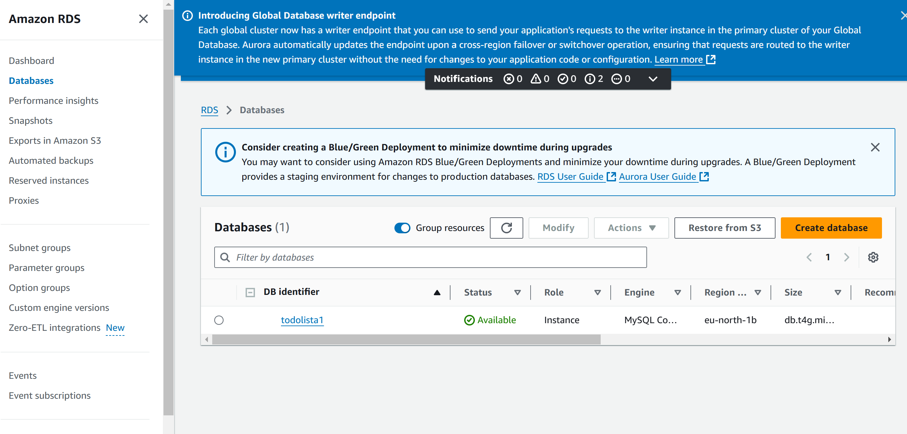
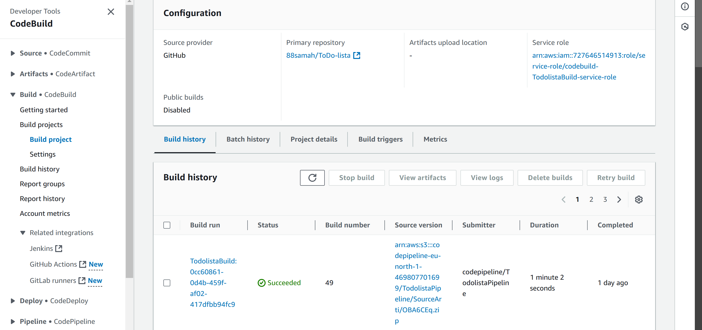
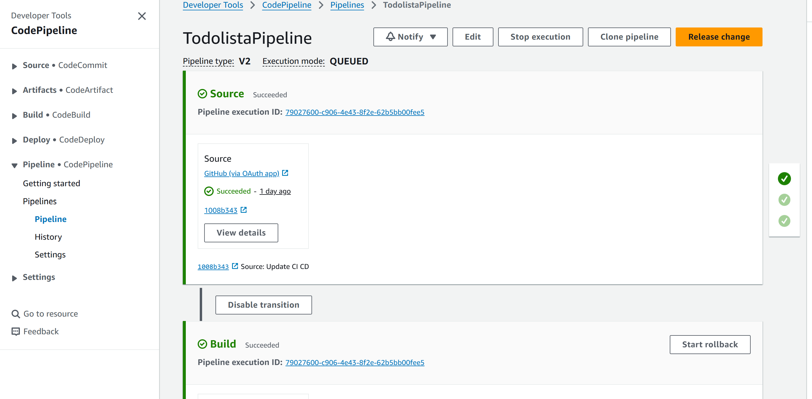
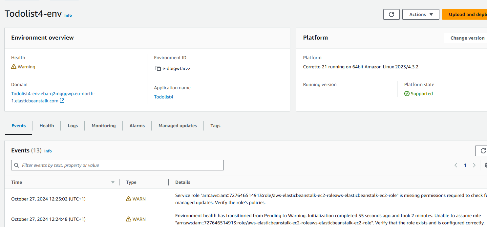
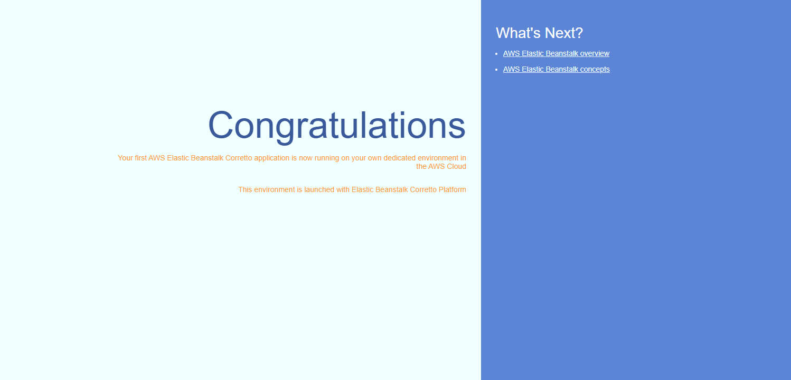

# ToDoLista Applikation

Jag har utvecklat en ToDo-lista applikation som gör det möjligt för användare att hantera uppgifter via CRUD-funktionalitet i ett REST API. I detta projekt har jag arbetat med User och ToDo-entiteter, där data lagras i en MySQL-databas som hostas på AWS RDS.

## Beskrivning av Steg

### 1. CI/CD Pipeline Konfiguration med GitHub Actions
För att effektivisera utvecklingsprocessen skapade jag en CI/CD-pipeline i GitHub Actions som hanterar hela byggprocessen och automatiskt deployar till AWS Elastic Beanstalk. Detta setup inkluderade en `ci-cd.yml` workflow-fil, som bygger applikationen, kör JUnit-tester, och deployar applikationen när ändringar pushas till master.
### 2. Web Service Funktionalitet i Spring Boot
Jag utvecklade CRUD-endpoints i Spring Boot för att användare ska kunna skapa, hämta, uppdatera och ta bort uppgifter och användarkonton:
- **User Endpoints**: För att skapa och hämta användaruppgifter.
- **ToDo Endpoints**: CRUD-funktionalitet för att skapa, hämta, uppdatera och ta bort uppgifter.

### 3. JUnit Tester
För att testa CRUD-funktionerna skrev jag JUnit-tester som körs som en del av CI/CD-pipelinen i GitHub Actions. Till exempel testade jag användarskapande i `UserService` för att säkerställa att en ny användare får ett unikt ID och att användarnamnet sparas korrekt.

### 4. Databas Konfiguration på AWS RDS
Jag skapade och konfigurerade en MySQL-databas med hjälp av AWS RDS där all data i applikationen lagras. Applikationen konfigurerades för att ansluta till databasen via JDBC, där `application.properties` innehåller RDS-detaljer som endpoint, användarnamn och lösenord.

### 5. Användning av AWS S3
Jag använde AWS S3 för lagring av statiska filer, såsom bilder som kan läggas till uppgifterna. S3-bucketen skapades automatiskt som en del av applikationskonfigurationen. Applikationen är integrerad med S3 för att kunna komma åt och lagra filer där, vilket möjliggör enkel hantering av bilagor kopplade till uppgifterna. Jag har kontrollerat att behörigheterna är korrekta för att säkerställa att applikationen har nödvändig åtkomst till S3-bucketen.

### 6. IAM (Identity and Access Management)
För att säkerställa säkerheten i min applikation använde jag AWS IAM för att hantera åtkomstkontroll. Jag skapade en IAM-användare med specifika behörigheter för att få tillgång till de nödvändiga AWS-tjänsterna som Elastic Beanstalk,S3 och RDS.

Jag tilldelade följande AWS-managed policyer för att ge den nödvändiga åtkomsten:

- **AdministratorAccess-AWSElasticBeanstalk**: Ger fullständig administrativ åtkomst till Elastic Beanstalk-tjänsten.
- **AWSElasticBeanstalkCustomPlatformforEC2Role**: Tillåter användning av anpassade plattformar på EC2.
- **AWSElasticBeanstalkEnhancedHealth**: Aktiverar förbättrad hälsokontroll av Elastic Beanstalk-applikationer.
- **AWSElasticBeanstalkManagedUpdatesCustomerRolePolicy**: Hanterar uppdateringar av Elastic Beanstalk-resurser.
- **AWSElasticBeanstalkMulticontainerDocker**: Möjliggör användning av flercontainermiljöer i Docker.
- **AWSElasticBeanstalkRoleWorkerTier**: Ger nödvändiga rättigheter för arbetsrolltier.
- **AWSElasticBeanstalkWebTier**: Ger nödvändiga rättigheter för webbrolltier.

Genom att tilldela dessa policyer säkerställde jag att användaren har tillgång till de funktioner som krävs för att driva och underhålla min applikation på ett säkert och effektivt sätt, samtidigt som jag begränsar åtkomsten för att minimera risken för obehörig åtkomst.

### 7. Utmaningar och Problemlösning med EC2
Jag skulle egentligen inte använda EC2 i min uppgift, men jag har försökt att köra Elastic Beanstalk utan den. Jag fick alltid fel med Auto Scaling Group, vilket var mycket förvirrande för mig. Jag sökte på nätet för att hitta en lösning på detta problem och till slut hittade jag en lösning som krävde att jag ändrade konfigurationen för att kunna gå vidare med uppgiften.

### 8. Testning i Postman
Jag använde Postman för att testa alla API-endpoints och säkerställa att de fungerar korrekt. Här testade jag GET, POST, PUT och DELETE-operationerna för både User och ToDo-endpoints, och bekräftade att de returnerar rätt svar och felmeddelanden.


# 9. Bilder
Bilderna hjälper till att visa att allt i AWS fungerar som det ska
```markdown
![RDS Database]
![CodeBuild Configuration]
![CodePipeline]
![Elastic Beanstalk]


